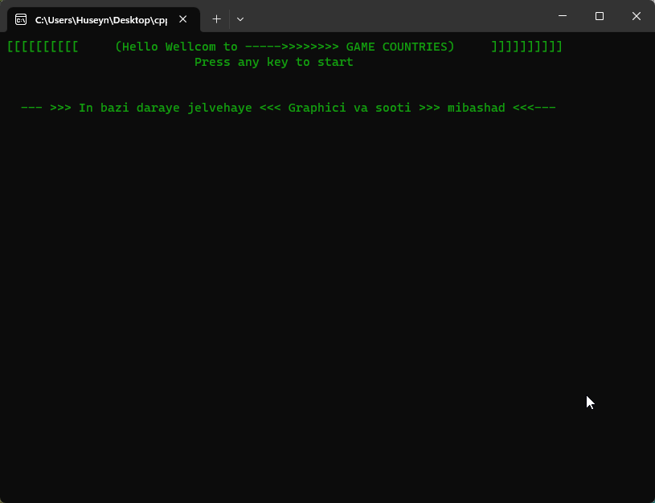

# BSP-Country-Names-Game

This project is a C++ implementation of the "Country Names Game" designed to enhance memory skills. The game involves randomly selecting a country name and displaying it with dashes representing each letter. The player guesses one letter at a time, trying to reveal the hidden letters in the country name.

## How to Play

### Starting the Game
To start the game, select option 1 from the main menu:

1. Start

### Entering Country Names
To enter country names, choose option 2 from the main menu:

2. Enter Name List

### Checking Country Names
To check the entered country names, select option 3 from the main menu:

3. Check Name List

### Deleting Country Names
To delete the entered country names, choose option 4 from the main menu:

4. Delete Name List

## Gameplay Demo (GIF)




## Additional Notes

- The program supports English language inputs only.
- The application runs in the console with default font and a black background with white text.
- The program is not case-sensitive for input.
- The game is designed for single-player mode, but multi-player options can be added with additional features.

For detailed instructions and the game's rules, refer to the project's source code.

## Build and Run

To build and run the program, ensure you have a C++ compiler installed. Then, compile the source code and execute the generated executable.

```plaintext
g++ main.cpp -o country_game
./country_game
